# 👨‍💻 Developer Guide - BioMining Platform

## 🎯 Introduction

Ce guide couvre tous les aspects du développement avec la plateforme BioMining, de l'architecture aux contributions avancées.

## 📋 Table des Matières

1. [Architecture Générale](#architecture-générale)
2. [Setup Environnement de Développement](#setup-environnement-de-développement)  
3. [Structure du Code](#structure-du-code)
4. [APIs et Interfaces](#apis-et-interfaces)
5. [Développement de Plugins](#développement-de-plugins)
6. [Tests et Validation](#tests-et-validation)
7. [Contribution Guidelines](#contribution-guidelines)
8. [Debugging Avancé](#debugging-avancé)

---

## 🏗️ Architecture Générale

### Vue d'Ensemble du Système

```mermaid
graph TB
    A[🖥️ GUI Interface] --> B[🧬 Bio Layer]
    A --> C[⛏️ Mining Layer] 
    A --> D[⚙️ Core System]
    
    B --> E[Real MEA Interface]
    B --> F[Signal Processing]
    B --> G[Spike Detection]
    
    C --> H[Hybrid Miner]
    C --> I[Entropy Integration]
    C --> J[Bitcoin Core]
    
    D --> K[Configuration]
    D --> L[Logging]
    D --> M[Threading]
    
    E --> N[🔌 Hardware Layer]
    N --> O[Serial/USB]
    N --> P[TCP/UDP]
    N --> Q[Custom APIs]
```



### Composants Principaux

#### 1. Bio Layer (`namespace BioMining::Bio`)
Responsable de l'interface avec le hardware MEA et du traitement biologique.

**Classes Principales** :
```cpp
namespace BioMining::Bio {
    class RealMEAInterface;      // Interface hardware MEA
    class MEAInterface;          // Interface simulée/base
    class BiologicalNetwork;     // Traitement réseaux neuronaux
    class SpikeDetector;         // Algorithmes détection spikes
    class SignalProcessor;       // Filtrage et amplification
}
```

#### 2. Crypto Layer (`namespace BioMining::Crypto`)  
Gère le mining Bitcoin et l'intégration de l'entropie biologique.

**Classes Principales** :
```cpp
namespace BioMining::Crypto {
    class HybridBitcoinMiner;    // Mining hybride principal
    class BitcoinMiner;          // Mining Bitcoin standard
    class EntropyIntegrator;     // Fusion entropie bio
    class HashOptimizer;         // Optimisations algorithmiques
}
```

#### 3. Core Layer (`namespace BioMining::Core`)
Services système, configuration, logging, threading.

**Classes Principales** :
```cpp  
namespace BioMining::Core {
    class Configuration;         // Gestion configuration
    class Logger;               // Système de logging
    class ThreadManager;        // Gestion threads
    class PerformanceMonitor;   // Monitoring performances
}
```

### Patterns Architecturaux

#### Factory Pattern
```cpp
// Création d'interfaces MEA selon le type
auto meaInterface = MEAInterfaceFactory::createInterface(
    MEADeviceType::MultiChannelSystems_MCS);
```

#### Observer Pattern  
```cpp
// Notification d'événements via signaux Qt
connect(meaInterface, &RealMEAInterface::spikeDetected,
        this, &MyClass::onSpikeDetected);
```

#### Strategy Pattern
```cpp
// Différentes stratégies de mining
class MiningStrategy {
    virtual double calculateHash(const BlockData& data) = 0;
};

class HybridStrategy : public MiningStrategy {
    double calculateHash(const BlockData& data) override;
};
```

---

## 🛠️ Setup Environnement de Développement

### Configuration de Base

#### Prérequis Développement
```bash
# Ubuntu/Debian - Outils de développement
sudo apt-get install -y build-essential cmake git gdb valgrind \
    clang-format clang-tidy cppcheck doxygen graphviz

# Qt Development
sudo apt-get install -y qt6-base-dev qt6-tools-dev \
    qt6-serialport-dev qt6-charts-dev qt6-doc-html

# Librairies supplémentaires  
sudo apt-get install -y libssl-dev libbenchmark-dev \
    libgtest-dev libgmock-dev catch2
```

#### Clone et Configuration
```bash
# Clone avec submodules
git clone --recursive https://github.com/jadaela-ara/BioMining.git
cd BioMining

# Configuration développeur
git config core.hooksPath .githooks
chmod +x .githooks/*

# Setup pre-commit hooks
pip install pre-commit
pre-commit install
```

#### Configuration CMake Développement
```bash
mkdir build-dev && cd build-dev

# Configuration debug complète
cmake -DCMAKE_BUILD_TYPE=Debug \
      -DBUILD_TESTS=ON \
      -DBUILD_EXAMPLES=ON \
      -DBUILD_BENCHMARKS=ON \
      -DENABLE_SANITIZERS=ON \
      -DENABLE_COVERAGE=ON \
      -DENABLE_STATIC_ANALYSIS=ON \
      ..

make -j$(nproc)
```

### IDE Configuration

#### VS Code (Recommandé)
Configuration `.vscode/settings.json` :
```json
{
    "C_Cpp.default.configurationProvider": "ms-vscode.cmake-tools",
    "cmake.buildDirectory": "${workspaceFolder}/build-dev",
    "C_Cpp.default.cppStandard": "c++17",
    "C_Cpp.default.intelliSenseMode": "gcc-x64",
    "files.associations": {
        "*.h": "cpp",
        "*.tcc": "cpp"
    },
    "clang-format.executable": "/usr/bin/clang-format-12",
    "editor.formatOnSave": true,
    "cmake.generator": "Ninja"
}
```

Extensions Recommandées :
- **C/C++** (Microsoft)
- **CMake Tools** (Microsoft) 
- **Qt Tools** (Qt Company)
- **GitLens** (Eric Amodio)
- **Clang-Format** (xaver)

#### Qt Creator
```bash
# Installation Qt Creator
sudo apt-get install qtcreator

# Import du projet
# File → Open File or Project → CMakeLists.txt
# Configure avec kit Qt6
```

#### CLion (JetBrains)
- Import CMake project
- Configure toolchains (GCC, Clang)
- Enable Qt support plugin
- Configure code style (Google C++)

### Outils de Développement

#### Static Analysis
```bash
# Clang-tidy
clang-tidy src/**/*.cpp -checks='-*,readability-*,performance-*,modernize-*'

# Cppcheck  
cppcheck --enable=all --std=c++17 src/ include/

# Include-what-you-use
iwyu_tool -p build-dev src/

# PVS-Studio (commercial)
pvs-studio-analyzer trace -- make -j$(nproc)
pvs-studio-analyzer analyze
plog-converter -a GA:1,2 -t tasklist PVS-Studio.log
```

#### Memory & Performance Analysis
```bash
# Valgrind - Memory leaks
valgrind --tool=memcheck --leak-check=full ./bin/biomining_tests

# Valgrind - Performance profiling
valgrind --tool=callgrind ./bin/performance_benchmark
kcachegrind callgrind.out.*

# AddressSanitizer (compilé avec -fsanitize=address)
./bin/biomining_tests

# Google Benchmark
./bin/benchmarks --benchmark_format=json > benchmark_results.json
```

---

## 🏭 Structure du Code

### Organisation des Répertoires

```
📁 BioMining/
├── 📁 include/                    # Headers publics
│   ├── 📁 bio/                    # Interfaces biologiques
│   │   ├── real_mea_interface.h   # Interface MEA hardware
│   │   ├── mea_interface.h        # Interface base/simulée
│   │   ├── biological_network.h   # Réseaux biologiques
│   │   └── spike_detector.h       # Détection spikes
│   ├── 📁 crypto/                 # Mining et cryptographie
│   │   ├── hybrid_bitcoin_miner.h # Mining hybride
│   │   ├── bitcoin_miner.h        # Mining standard
│   │   └── entropy_integrator.h   # Intégration entropie
│   └── 📁 core/                   # Système central
│       ├── configuration.h        # Configuration
│       ├── logger.h              # Logging
│       └── thread_manager.h      # Threading
├── 📁 src/
│   ├── 📁 cpp/                    # Implémentation C++
│   │   ├── bio/                   # Code bio
│   │   ├── crypto/                # Code crypto  
│   │   ├── core/                  # Code système
│   │   └── gui/                   # Interface graphique
│   └── 📁 qplus/                  # Code quantique (futur)
├── 📁 tests/                      # Tests unitaires
│   ├── 📁 unit/                   # Tests unitaires  
│   ├── 📁 integration/            # Tests d'intégration
│   ├── 📁 performance/            # Benchmarks
│   └── 📁 mocks/                  # Mocks pour tests
├── 📁 examples/                   # Exemples d'utilisation
├── 📁 docs/                       # Documentation
├── 📁 scripts/                    # Scripts utilitaires
├── 📁 config/                     # Configurations par défaut
└── 📁 third_party/               # Dépendances externes
```

### Conventions de Code

#### Style Guide
Nous suivons le **Google C++ Style Guide** avec adaptations :

```cpp
// Naming conventions
class RealMEAInterface;           // PascalCase pour classes
void performCalibration();        // camelCase pour méthodes
int electrodeCount_;             // camelCase + underscore pour membres
const int MAX_ELECTRODES = 60;   // UPPER_CASE pour constantes

// Namespace organization
namespace BioMining {
namespace Bio {
    class RealMEAInterface {
    public:
        // Public interface first
        bool initialize(const RealMEAConfig& config);
        
    private:
        // Private members with trailing underscore
        ConnectionStatus status_;
        std::unique_ptr<QSerialPort> serialPort_;
    };
}
}

// Include guards (prefer #pragma once)
#pragma once

// Smart pointers preference
std::unique_ptr<RealMEAInterface> interface = 
    std::make_unique<RealMEAInterface>();

// Qt-specific conventions
class MyClass : public QObject {
    Q_OBJECT  // Always first in Qt classes
    
public slots:
    void onDataReceived();  // Qt slots clearly marked
    
signals:
    void dataReady(const QVector<double>& data);
};
```

#### Documentation avec Doxygen
```cpp
/**
 * @brief Interface pour dispositifs MEA hardware réels
 * 
 * Cette classe fournit une interface unifiée pour communiquer
 * avec différents types de Multi-Electrode Arrays hardware.
 * 
 * @par Usage Example:
 * @code
 * RealMEAConfig config;
 * config.deviceType = MEADeviceType::MultiChannelSystems_MCS;
 * 
 * RealMEAInterface mea;
 * if (mea.initialize(config)) {
 *     auto data = mea.readElectrodeData();
 * }
 * @endcode
 * 
 * @see MEAInterfaceFactory
 * @see RealMEAConfig
 * @since 1.1.0
 */
class RealMEAInterface : public QObject {
    /**
     * @brief Initialise la connexion avec le dispositif MEA
     * 
     * @param config Configuration complète du dispositif
     * @return true si la connexion est établie avec succès
     * @throws ConnectionException Si le dispositif n'est pas accessible
     * 
     * @par Performance:
     * Cette méthode peut prendre 2-5 secondes selon le dispositif.
     * 
     * @warning Assurez-vous que le dispositif est physiquement connecté
     */
    bool initialize(const RealMEAConfig& config);
};
```

### Architecture des Headers

#### Header Principal - Interface Publique
```cpp
// include/bio/real_mea_interface.h
#pragma once

#include <QObject>
#include <QVector>
#include <memory>

// Forward declarations pour réduire dépendances
QT_BEGIN_NAMESPACE
class QSerialPort;
class QTcpSocket;
QT_END_NAMESPACE

namespace BioMining {
namespace Bio {

// Configuration structures
struct RealMEAConfig {
    // ... définition
};

// Data structures  
struct ElectrodeData {
    // ... définition
};

/**
 * @brief Interface principale pour MEA hardware
 */
class BIOMINING_EXPORT RealMEAInterface : public QObject {
    Q_OBJECT
    
public:
    // Interface publique claire et stable
    explicit RealMEAInterface(QObject* parent = nullptr);
    ~RealMEAInterface() override;
    
    // Méthodes principales
    bool initialize(const RealMEAConfig& config);
    QVector<ElectrodeData> readElectrodeData();
    
signals:
    void electrodeDataReady(const QVector<ElectrodeData>& data);
    
private:
    class Impl;  // Pimpl idiom pour stabilité ABI
    std::unique_ptr<Impl> d_;
};

} // namespace Bio  
} // namespace BioMining

// Qt Meta-Object registration
Q_DECLARE_METATYPE(BioMining::Bio::ElectrodeData)
```

#### Implémentation avec Pimpl
```cpp
// src/cpp/bio/real_mea_interface.cpp
#include "bio/real_mea_interface.h"
#include "bio/real_mea_interface_p.h"  // Private header

namespace BioMining {
namespace Bio {

// Pimpl implementation - stable ABI
class RealMEAInterface::Impl {
public:
    explicit Impl(RealMEAInterface* parent);
    
    bool initializeSerial(const RealMEAConfig& config);
    bool initializeNetwork(const RealMEAConfig& config);
    
    RealMEAInterface* q_;  // Back-pointer to public interface
    std::unique_ptr<QSerialPort> serialPort_;
    RealMEAConfig config_;
    // ... private members
};

// Public interface implementation
RealMEAInterface::RealMEAInterface(QObject* parent)
    : QObject(parent)
    , d_(std::make_unique<Impl>(this))
{
}

bool RealMEAInterface::initialize(const RealMEAConfig& config) {
    return d_->initializeSerial(config) || d_->initializeNetwork(config);
}

} // namespace Bio
} // namespace BioMining
```

---

## 🔌 APIs et Interfaces

### Interface Plugin System

#### Base Plugin Interface
```cpp
// include/core/plugin_interface.h
namespace BioMining {
namespace Core {

/**
 * @brief Interface de base pour tous les plugins BioMining
 */
class IPlugin {
public:
    virtual ~IPlugin() = default;
    
    // Métadonnées plugin
    virtual QString name() const = 0;
    virtual QString version() const = 0;
    virtual QString description() const = 0;
    virtual QStringList dependencies() const { return {}; }
    
    // Lifecycle
    virtual bool initialize() = 0;
    virtual void shutdown() = 0;
    
    // Configuration
    virtual QJsonObject defaultConfiguration() const { return {}; }
    virtual bool configure(const QJsonObject& config) { return true; }
};

/**
 * @brief Plugin factory interface
 */
class IPluginFactory {
public:
    virtual ~IPluginFactory() = default;
    virtual std::unique_ptr<IPlugin> createPlugin() = 0;
    virtual QString pluginId() const = 0;
};

} // namespace Core
} // namespace BioMining

// Macro pour faciliter la création de plugins
#define BIOMINING_PLUGIN_FACTORY(ClassName, PluginId) \
class ClassName##Factory : public BioMining::Core::IPluginFactory { \
public: \
    std::unique_ptr<BioMining::Core::IPlugin> createPlugin() override { \
        return std::make_unique<ClassName>(); \
    } \
    QString pluginId() const override { return PluginId; } \
}; \
extern "C" BIOMINING_EXPORT BioMining::Core::IPluginFactory* createPluginFactory() { \
    return new ClassName##Factory; \
}
```

#### MEA Device Plugin Interface
```cpp
// include/bio/mea_device_plugin.h
namespace BioMining {
namespace Bio {

/**
 * @brief Interface spécialisée pour plugins MEA
 */
class IMEADevicePlugin : public Core::IPlugin {
public:
    // Capabilities
    virtual QStringList supportedDeviceTypes() const = 0;
    virtual QStringList supportedProtocols() const = 0;
    
    // Device operations
    virtual bool detectDevice(const QString& devicePath) = 0;
    virtual std::unique_ptr<RealMEAInterface> createInterface() = 0;
    virtual RealMEAConfig getDefaultConfig() const = 0;
    
    // Device-specific features
    virtual bool supportsStimulation() const { return false; }
    virtual bool supportsImpedanceTesting() const { return true; }
    virtual int maxElectrodeCount() const = 0;
    virtual double maxSamplingRate() const = 0;
};

} // namespace Bio
} // namespace BioMining
```

### Extension Points

#### Custom Mining Algorithms
```cpp
// include/crypto/mining_algorithm.h
namespace BioMining {
namespace Crypto {

/**
 * @brief Interface pour algorithmes de mining personnalisés
 */
class IMiningAlgorithm {
public:
    virtual ~IMiningAlgorithm() = default;
    
    // Algorithm info
    virtual QString name() const = 0;
    virtual QString description() const = 0;
    
    // Mining operations
    virtual bool initialize(const QJsonObject& config) = 0;
    virtual uint64_t calculateHash(const BlockData& blockData,
                                  const BiologicalEntropy& bioEntropy) = 0;
    
    // Performance characteristics
    virtual double expectedHashRate() const = 0;
    virtual double biologicalEntropyWeight() const = 0;
};

/**
 * @brief Registry pour algorithmes de mining
 */
class MiningAlgorithmRegistry {
public:
    static MiningAlgorithmRegistry& instance();
    
    void registerAlgorithm(const QString& name, 
                          std::unique_ptr<IMiningAlgorithm> algorithm);
    
    IMiningAlgorithm* getAlgorithm(const QString& name) const;
    QStringList availableAlgorithms() const;
    
private:
    std::unordered_map<QString, std::unique_ptr<IMiningAlgorithm>> algorithms_;
};

} // namespace Crypto
} // namespace BioMining
```

---

## 🔧 Développement de Plugins

### Plugin MEA Device - Exemple Complet

#### Structure du Plugin
```
📁 plugins/mea_blackrock/
├── 📄 CMakeLists.txt
├── 📄 plugin.json              # Métadonnées
├── 📁 include/
│   └── blackrock_mea_plugin.h  # Interface publique
├── 📁 src/
│   ├── blackrock_mea_plugin.cpp      # Implémentation
│   ├── blackrock_mea_interface.cpp   # Interface MEA spécialisée
│   └── blackrock_protocol.cpp       # Protocole communication
└── 📁 resources/
    ├── device_configs.json     # Configurations par défaut
    └── calibration_data.json   # Données calibration
```

#### Métadonnées Plugin
```json
{
  "plugin": {
    "id": "biomining.mea.blackrock",
    "name": "Blackrock MEA Plugin", 
    "version": "1.0.0",
    "description": "Support pour dispositifs Blackrock CerePlex",
    "author": "BioMining Team",
    "license": "MIT",
    "api_version": "1.1.0"
  },
  "capabilities": {
    "device_types": ["CerePlex_Direct", "CerePlex_W"],
    "protocols": ["Serial", "USB", "Network"],
    "max_electrodes": 96,
    "max_sampling_rate": 30000,
    "features": {
      "stimulation": true,
      "impedance_testing": true,  
      "real_time_filtering": true,
      "spike_sorting": false
    }
  },
  "dependencies": [
    "qt6-serialport >= 6.0",
    "blackrock-sdk >= 2.5"
  ]
}
```

#### Implémentation du Plugin
```cpp
// blackrock_mea_plugin.cpp
#include "blackrock_mea_plugin.h"
#include "blackrock_mea_interface.h"

namespace BioMining {
namespace Plugins {

class BlackrockMEAPlugin : public Bio::IMEADevicePlugin {
public:
    // Plugin metadata
    QString name() const override { return "Blackrock MEA Plugin"; }
    QString version() const override { return "1.0.0"; }
    QString description() const override {
        return "Support pour dispositifs Blackrock CerePlex";
    }
    
    // Plugin lifecycle
    bool initialize() override {
        // Initialiser SDK Blackrock
        if (!BlackrockSDK::initialize()) {
            qCritical() << "Échec initialisation SDK Blackrock";
            return false;
        }
        
        qInfo() << "Plugin Blackrock MEA initialisé avec succès";
        return true;
    }
    
    void shutdown() override {
        BlackrockSDK::cleanup();
        qInfo() << "Plugin Blackrock MEA fermé";
    }
    
    // MEA device capabilities
    QStringList supportedDeviceTypes() const override {
        return {"CerePlex_Direct", "CerePlex_W", "CerePlex_E"};
    }
    
    QStringList supportedProtocols() const override {
        return {"Serial", "USB", "Ethernet"};
    }
    
    bool detectDevice(const QString& devicePath) override {
        // Détection spécifique Blackrock
        return BlackrockSDK::detectDevice(devicePath);
    }
    
    std::unique_ptr<Bio::RealMEAInterface> createInterface() override {
        return std::make_unique<BlackrockMEAInterface>();
    }
    
    Bio::RealMEAConfig getDefaultConfig() const override {
        Bio::RealMEAConfig config;
        config.deviceType = Bio::MEADeviceType::Blackrock_CerePlex;
        config.protocol = Bio::CommunicationProtocol::SerialPort;
        config.baudRate = 921600;  // Blackrock high-speed
        config.electrodeCount = 96;
        config.samplingRate = 30000.0;
        config.amplification = 5000.0;  // Blackrock typical
        return config;
    }
    
    // Device-specific features
    bool supportsStimulation() const override { return true; }
    bool supportsImpedanceTesting() const override { return true; }
    int maxElectrodeCount() const override { return 96; }
    double maxSamplingRate() const override { return 30000.0; }
    
private:
    bool sdkInitialized_ = false;
};

// Interface MEA spécialisée Blackrock
class BlackrockMEAInterface : public Bio::RealMEAInterface {
    Q_OBJECT
    
public:
    explicit BlackrockMEAInterface(QObject* parent = nullptr);
    
protected:
    // Implémentation spécifique Blackrock
    bool connectToDevice() override;
    QVector<Bio::ElectrodeData> readElectrodeDataImpl() override;
    bool stimulateElectrodeImpl(int electrodeId, double amplitude, 
                               double duration) override;
    
private:
    std::unique_ptr<BlackrockDevice> device_;
    std::unique_ptr<BlackrockProtocol> protocol_;
};

} // namespace Plugins
} // namespace BioMining

// Registration macro
BIOMINING_PLUGIN_FACTORY(BlackrockMEAPlugin, "biomining.mea.blackrock")
```

### Plugin Mining Algorithm - Exemple

```cpp
// custom_mining_plugin.cpp
namespace BioMining {
namespace Plugins {

/**
 * @brief Algorithme de mining avec pondération adaptative bio-entropie
 */
class AdaptiveBioMiningAlgorithm : public Crypto::IMiningAlgorithm {
public:
    QString name() const override { return "Adaptive Bio Mining"; }
    QString description() const override {
        return "Mining avec adaptation dynamique de l'entropie biologique";
    }
    
    bool initialize(const QJsonObject& config) override {
        adaptationRate_ = config["adaptation_rate"].toDouble(0.1);
        maxBioWeight_ = config["max_bio_weight"].toDouble(0.5);
        
        // Initialiser historique performance
        performanceHistory_.reserve(1000);
        return true;
    }
    
    uint64_t calculateHash(const BlockData& blockData,
                          const BiologicalEntropy& bioEntropy) override {
        // Calculer hash standard
        uint64_t standardHash = SHA256::hash(blockData.serialize());
        
        // Adapter poids selon performance récente
        double currentWeight = adaptBiologicalWeight(bioEntropy.quality);
        
        // Intégrer entropie biologique
        uint64_t bioHash = integrateEntropy(bioEntropy, currentWeight);
        
        // Combiner les hashs
        uint64_t finalHash = combineHashes(standardHash, bioHash, currentWeight);
        
        // Enregistrer performance pour adaptation future
        recordPerformance(finalHash, bioEntropy.quality);
        
        return finalHash;
    }
    
    double expectedHashRate() const override {
        // Estimer basé sur historique
        return calculateAverageHashRate();
    }
    
    double biologicalEntropyWeight() const override {
        return currentBioWeight_;
    }
    
private:
    double adaptBiologicalWeight(double entropyQuality) {
        // Algorithme d'adaptation basé sur performance
        if (entropyQuality > 0.9 && recentPerformanceGood()) {
            currentBioWeight_ = std::min(currentBioWeight_ + adaptationRate_, 
                                       maxBioWeight_);
        } else if (entropyQuality < 0.7 || recentPerformancePoor()) {
            currentBioWeight_ = std::max(currentBioWeight_ - adaptationRate_,
                                       0.1);
        }
        
        return currentBioWeight_;
    }
    
    uint64_t integrateEntropy(const BiologicalEntropy& entropy, 
                             double weight) {
        // Mélange sophistiqué des données biologiques
        std::vector<uint8_t> entropyBytes;
        
        // Convertir spikes en bytes  
        for (const auto& spike : entropy.recentSpikes) {
            uint64_t spikeData = static_cast<uint64_t>(spike.amplitude * 1000) ^
                               static_cast<uint64_t>(spike.timestamp);
            
            auto bytes = reinterpret_cast<uint8_t*>(&spikeData);
            entropyBytes.insert(entropyBytes.end(), bytes, bytes + sizeof(uint64_t));
        }
        
        // Hachage des données biologiques
        return XXHash64::hash(entropyBytes.data(), entropyBytes.size());
    }
    
    // Membres privés
    double adaptationRate_ = 0.1;
    double maxBioWeight_ = 0.5;
    double currentBioWeight_ = 0.2;
    
    std::vector<PerformanceRecord> performanceHistory_;
};

} // namespace Plugins
} // namespace BioMining
```

### Build System pour Plugins

#### CMakeLists.txt pour Plugin
```cmake
# plugins/mea_blackrock/CMakeLists.txt
cmake_minimum_required(VERSION 3.20)
project(BlackrockMEAPlugin)

# Find dependencies
find_package(Qt6 REQUIRED COMPONENTS Core SerialPort)
find_package(biomining_core REQUIRED)

# Plugin sources
set(PLUGIN_SOURCES
    src/blackrock_mea_plugin.cpp
    src/blackrock_mea_interface.cpp
    src/blackrock_protocol.cpp
)

set(PLUGIN_HEADERS
    include/blackrock_mea_plugin.h
    include/blackrock_mea_interface.h
    include/blackrock_protocol.h
)

# Create plugin library
add_library(blackrock_mea_plugin SHARED
    ${PLUGIN_SOURCES}
    ${PLUGIN_HEADERS}
)

target_include_directories(blackrock_mea_plugin
    PRIVATE include
    PUBLIC $<BUILD_INTERFACE:${CMAKE_CURRENT_SOURCE_DIR}/include>
)

target_link_libraries(blackrock_mea_plugin
    PUBLIC biomining_core Qt6::Core Qt6::SerialPort
    PRIVATE blackrock_sdk
)

# Plugin properties
set_target_properties(blackrock_mea_plugin PROPERTIES
    CXX_STANDARD 17
    CXX_STANDARD_REQUIRED ON
    POSITION_INDEPENDENT_CODE ON
    PREFIX ""  # Pas de prefixe "lib"
)

# Install plugin
install(TARGETS blackrock_mea_plugin
    LIBRARY DESTINATION lib/biomining/plugins
    RUNTIME DESTINATION bin/biomining/plugins
)

install(FILES plugin.json
    DESTINATION lib/biomining/plugins/blackrock_mea/
)
```

---

## 🧪 Tests et Validation

### Architecture des Tests

#### Pyramide de Tests
```
        🔺 E2E Tests (5%)
       ────────────────
      🔺🔺 Integration Tests (15%)  
     ──────────────────────────
   🔺🔺🔺🔺 Unit Tests (80%)
  ──────────────────────────────
```

### Tests Unitaires

#### Framework de Test
Nous utilisons **Google Test** + **Google Mock** + **Qt Test**

```cpp
// tests/unit/bio/test_real_mea_interface.cpp
#include <gtest/gtest.h>
#include <gmock/gmock.h>
#include <QTest>

#include "bio/real_mea_interface.h"
#include "mocks/mock_serial_port.h"

using namespace BioMining::Bio;
using namespace testing;

class RealMEAInterfaceTest : public ::testing::Test {
protected:
    void SetUp() override {
        // Mock injection
        mockSerialPort = std::make_unique<MockSerialPort>();
        meaInterface = std::make_unique<RealMEAInterface>();
        
        // Inject mock via dependency injection
        meaInterface->setSerialPort(mockSerialPort.get());
    }
    
    void TearDown() override {
        meaInterface.reset();
        mockSerialPort.reset();
    }
    
    std::unique_ptr<MockSerialPort> mockSerialPort;
    std::unique_ptr<RealMEAInterface> meaInterface;
};

TEST_F(RealMEAInterfaceTest, InitializeWithValidConfig) {
    // Arrange
    RealMEAConfig config;
    config.deviceType = MEADeviceType::MultiChannelSystems_MCS;
    config.protocol = CommunicationProtocol::SerialPort;
    config.devicePath = "/dev/ttyUSB0";
    
    EXPECT_CALL(*mockSerialPort, open(QIODevice::ReadWrite))
        .WillOnce(Return(true));
    EXPECT_CALL(*mockSerialPort, isOpen())
        .WillOnce(Return(true));
    
    // Act
    bool result = meaInterface->initialize(config);
    
    // Assert
    EXPECT_TRUE(result);
    EXPECT_EQ(meaInterface->getStatus(), 
              RealMEAInterface::ConnectionStatus::Connected);
}

TEST_F(RealMEAInterfaceTest, ReadElectrodeDataReturnsValidData) {
    // Arrange - Initialize interface first
    RealMEAConfig config;
    setupValidConfig(config);
    ASSERT_TRUE(meaInterface->initialize(config));
    
    // Mock data response
    QByteArray mockResponse = createMockElectrodeResponse(60);
    EXPECT_CALL(*mockSerialPort, readAll())
        .WillOnce(Return(mockResponse));
    
    // Act
    QVector<ElectrodeData> data = meaInterface->readElectrodeData();
    
    // Assert
    EXPECT_EQ(data.size(), 60);
    for (const auto& electrode : data) {
        EXPECT_GE(electrode.electrodeId, 0);
        EXPECT_LT(electrode.electrodeId, 60);
        EXPECT_GT(electrode.signalQuality, 0.0);
        EXPECT_LE(electrode.signalQuality, 1.0);
    }
}

TEST_F(RealMEAInterfaceTest, SpikeDetectionEmitsCorrectSignals) {
    // Arrange
    setupInitializedInterface();
    
    QSignalSpy spikeSpy(meaInterface.get(), 
                       &RealMEAInterface::spikeDetected);
    
    // Enable spike detection
    meaInterface->enableSpikeDetection(true);
    meaInterface->setSpikeThreshold(-50.0);
    
    // Mock spike data
    QByteArray spikeData = createMockSpikeResponse(-75.5, 15);
    EXPECT_CALL(*mockSerialPort, readAll())
        .WillOnce(Return(spikeData));
    
    // Act
    meaInterface->readElectrodeData();
    
    // Assert
    EXPECT_EQ(spikeSpy.count(), 1);
    
    QList<QVariant> arguments = spikeSpy.takeFirst();
    SpikeEvent spike = qvariant_cast<SpikeEvent>(arguments.at(0));
    
    EXPECT_EQ(spike.electrodeId, 15);
    EXPECT_NEAR(spike.amplitude, -75.5, 0.1);
}

// Test paramétrisé pour différents dispositifs
class MEADeviceParameterizedTest : 
    public RealMEAInterfaceTest,
    public ::testing::WithParamInterface<MEADeviceType> {
};

TEST_P(MEADeviceParameterizedTest, InitializeWithDifferentDevices) {
    MEADeviceType deviceType = GetParam();
    
    RealMEAConfig config = MEAInterfaceFactory::getDefaultConfig(deviceType);
    
    // Mock device-specific responses
    setupMockForDeviceType(deviceType);
    
    bool result = meaInterface->initialize(config);
    
    EXPECT_TRUE(result) << "Failed to initialize device type: " 
                       << static_cast<int>(deviceType);
}

INSTANTIATE_TEST_SUITE_P(
    AllMEADevices,
    MEADeviceParameterizedTest,
    ::testing::Values(
        MEADeviceType::MultiChannelSystems_MCS,
        MEADeviceType::Blackrock_CerePlex,
        MEADeviceType::Plexon_OmniPlex,
        MEADeviceType::Intan_RHD
    )
);
```

#### Mocks et Stubs

```cpp  
// tests/mocks/mock_serial_port.h
class MockSerialPort : public QSerialPort {
    Q_OBJECT
    
public:
    MOCK_METHOD(bool, open, (QIODevice::OpenMode mode), (override));
    MOCK_METHOD(void, close, (), (override));
    MOCK_METHOD(bool, isOpen, (), (const, override));
    MOCK_METHOD(QByteArray, readAll, (), (override));
    MOCK_METHOD(qint64, write, (const QByteArray& data), (override));
    MOCK_METHOD(bool, waitForReadyRead, (int msecs), (override));
};

// Helper functions for test data
class TestDataGenerator {
public:
    static QByteArray createMockElectrodeResponse(int electrodeCount) {
        QByteArray response;
        QDataStream stream(&response, QIODevice::WriteOnly);
        
        for (int i = 0; i < electrodeCount; ++i) {
            // Generate realistic electrode data
            double voltage = generateRealisticVoltage();
            double impedance = generateRealisticImpedance();
            qint64 timestamp = QDateTime::currentMSecsSinceEpoch() * 1000;
            
            stream << i << voltage << impedance << timestamp;
        }
        
        return response;
    }
    
private:
    static double generateRealisticVoltage() {
        // Voltage in microvolts, typical range -100 to +100 μV
        std::random_device rd;
        std::mt19937 gen(rd());
        std::normal_distribution<> dist(0.0, 30.0);
        return dist(gen);
    }
};
```

### Tests d'Intégration

#### Test MEA Hardware Complet
```cpp  
// tests/integration/test_mea_complete_workflow.cpp
class MEACompleteWorkflowTest : public ::testing::Test {
protected:
    void SetUp() override {
        // Skip si pas de hardware MEA disponible
        if (!detectRealMEAHardware()) {
            GTEST_SKIP() << "Pas de hardware MEA détecté - tests ignorés";
        }
        
        meaInterface = std::make_unique<RealMEAInterface>();
    }
    
private:
    bool detectRealMEAHardware() {
        QStringList devices = MEAInterfaceFactory::getSupportedDevices();
        return !devices.isEmpty();
    }
    
    std::unique_ptr<RealMEAInterface> meaInterface;
};

TEST_F(MEACompleteWorkflowTest, CompleteAcquisitionCycle) {
    // Configuration automatique
    auto config = MEAInterfaceFactory::getDefaultConfig(
        MEADeviceType::MultiChannelSystems_MCS);
    
    // 1. Initialisation
    ASSERT_TRUE(meaInterface->initialize(config))
        << "Échec initialisation: " << meaInterface->getLastError();
    
    // 2. Calibration
    ASSERT_TRUE(meaInterface->performFullCalibration())
        << "Échec calibration";
    
    // 3. Test qualité signal
    double quality = meaInterface->getSignalQuality();
    EXPECT_GT(quality, 0.7) << "Qualité signal trop faible: " << quality;
    
    // 4. Acquisition données
    auto data = meaInterface->readElectrodeData();
    EXPECT_FALSE(data.isEmpty()) << "Aucune donnée acquise";
    
    // 5. Test stimulation (si supporté)
    if (supportsStimulation()) {
        EXPECT_TRUE(meaInterface->stimulateElectrode(0, 1.0, 2.0))
            << "Échec stimulation test";
    }
    
    // 6. Test détection spikes
    meaInterface->enableSpikeDetection(true);
    
    QSignalSpy spikeSpy(meaInterface.get(), 
                       &RealMEAInterface::spikeDetected);
    
    // Attendre quelques secondes pour spikes naturels
    QTest::qWait(5000);
    
    // Au moins quelques spikes attendus en conditions normales
    EXPECT_GT(spikeSpy.count(), 0) << "Aucun spike détecté";
}
```

### Tests de Performance/Benchmarks

#### Benchmark Acquisition MEA
```cpp
// tests/performance/benchmark_mea_acquisition.cpp
#include <benchmark/benchmark.h>
#include "bio/real_mea_interface.h"

static void BM_MEADataAcquisition(benchmark::State& state) {
    RealMEAInterface mea;
    RealMEAConfig config = getTestConfig();
    
    if (!mea.initialize(config)) {
        state.SkipWithError("Cannot initialize MEA interface");
        return;
    }
    
    for (auto _ : state) {
        auto data = mea.readElectrodeData();
        benchmark::DoNotOptimize(data);
    }
    
    // Métriques personnalisées
    state.SetItemsProcessed(state.iterations() * 60);  // 60 électrodes
    state.SetBytesProcessed(state.iterations() * 60 * sizeof(ElectrodeData));
}

BENCHMARK(BM_MEADataAcquisition)
    ->Unit(benchmark::kMicrosecond)
    ->Repetitions(10)
    ->ReportAggregatesOnly(true);

static void BM_SpikeDetectionLatency(benchmark::State& state) {
    RealMEAInterface mea;
    setupMEAWithSpikeDetection(mea);
    
    // Pré-générer données avec spikes
    auto testData = generateSpikeTestData(state.range(0));
    
    for (auto _ : state) {
        auto start = std::chrono::high_resolution_clock::now();
        
        // Injecter données de test
        mea.processMockData(testData);
        
        auto end = std::chrono::high_resolution_clock::now();
        auto elapsed = std::chrono::duration_cast<std::chrono::microseconds>(
            end - start);
        
        state.SetIterationTime(elapsed.count() * 1e-6);
    }
    
    state.SetComplexityN(state.range(0));
}

BENCHMARK(BM_SpikeDetectionLatency)
    ->Range(1, 1000)  // Nombre de spikes
    ->Complexity(benchmark::oN)
    ->UseManualTime();

// Benchmark mining hybride
static void BM_HybridMiningHashRate(benchmark::State& state) {
    HybridBitcoinMiner miner;
    auto meaInterface = createMockMEAInterface();
    
    miner.setMEAInterface(meaInterface.get());
    miner.setBiologicalEntropy(true);
    
    BitcoinMiningConfig config;
    config.biologicalWeight = state.range(0) / 100.0;  // Poids en %
    
    uint64_t hashCount = 0;
    
    for (auto _ : state) {
        auto hash = miner.calculateSingleHash(getTestBlockData());
        hashCount++;
        benchmark::DoNotOptimize(hash);
    }
    
    // Hash rate en H/s
    state.counters["HashRate"] = benchmark::Counter(
        hashCount, benchmark::Counter::kIsRate);
    state.counters["BiologicalWeight"] = state.range(0);
}

BENCHMARK(BM_HybridMiningHashRate)
    ->Range(0, 50)  // Poids biologique 0-50%
    ->Unit(benchmark::kSecond);
```

### Test Coverage et Reporting

#### Configuration Coverage
```bash
# Compilation avec coverage
mkdir build-coverage && cd build-coverage
cmake -DCMAKE_BUILD_TYPE=Debug \
      -DENABLE_COVERAGE=ON \
      -DBUILD_TESTS=ON ..

make -j$(nproc)

# Exécution tests avec coverage
ctest --output-on-failure

# Génération rapport coverage
gcovr --root .. \
      --filter '../src/.*' \
      --exclude '../tests/.*' \
      --html-details coverage_report.html \
      --html-title "BioMining Code Coverage"

# Ou avec lcov
lcov --capture --directory . --output-file coverage.info
lcov --remove coverage.info '/usr/*' --output-file coverage.info
lcov --remove coverage.info '*/tests/*' --output-file coverage.info
genhtml coverage.info --output-directory coverage_html
```

---

## 🤝 Contribution Guidelines

### Workflow de Contribution

#### 1. Fork et Clone
```bash
# Fork sur GitHub puis
git clone https://github.com/your-username/BioMining.git
cd BioMining
git remote add upstream https://github.com/jadaela-ara/BioMining.git
```

#### 2. Création de Branch
```bash
# Branch depuis develop
git checkout develop
git pull upstream develop
git checkout -b feature/your-feature-name

# Ou pour bugfix
git checkout -b bugfix/issue-number-description

# Pour plugin
git checkout -b plugin/plugin-name
```

#### 3. Développement
```bash
# Commits atomiques avec messages clairs
git add src/bio/new_feature.cpp
git commit -m "feat(bio): Add advanced spike clustering algorithm

- Implement DBSCAN-based spike clustering
- Add configurable clustering parameters  
- Include performance optimizations for real-time processing
- Add unit tests with 95% coverage

Closes #123"

# Convention: type(scope): description
# Types: feat, fix, docs, style, refactor, test, chore
# Scopes: bio, crypto, core, gui, tests, docs
```

#### 4. Tests et Validation
```bash
# Tests complets avant push
make test
make benchmark
make static-analysis

# Vérification coverage
make coverage
# Target: >90% line coverage, >85% branch coverage
```

#### 5. Pull Request
```bash
# Push et création PR
git push origin feature/your-feature-name

# Créer PR sur GitHub avec template:
# - Description détaillée
# - Tests ajoutés/modifiés  
# - Impact performance
# - Breaking changes
# - Documentation mise à jour
```

### Standards de Code

#### Pre-commit Hooks
```bash
# Installation
pip install pre-commit
pre-commit install

# Configuration .pre-commit-config.yaml
repos:
  - repo: https://github.com/pre-commit/pre-commit-hooks
    rev: v4.4.0
    hooks:
      - id: trailing-whitespace
      - id: end-of-file-fixer
      - id: check-yaml
      - id: check-added-large-files
        
  - repo: https://github.com/psf/black
    rev: 22.12.0
    hooks:
      - id: black
        language_version: python3
        
  - repo: local
    hooks:
      - id: clang-format
        name: clang-format
        entry: clang-format-12
        language: system
        files: \.(cpp|hpp|c|h|cc|cxx)$
        args: ['-style=Google', '-i']
        
      - id: cmake-format
        name: cmake-format
        entry: cmake-format
        language: system
        files: CMakeLists\.txt$|\.cmake$
        args: ['-i']
```

### Code Review Process

#### Checklist Reviewer
- [ ] **Fonctionnalité** : Répond aux requis spécifiés
- [ ] **Architecture** : Respecte patterns existants  
- [ ] **Performance** : Pas de régression, optimisations appropriées
- [ ] **Tests** : Coverage >90%, tests edge cases
- [ ] **Documentation** : API documentée, exemples fournis
- [ ] **Style** : Respecte conventions, pas de warnings
- [ ] **Sécurité** : Pas de vulnérabilités évidentes
- [ ] **Compatibilité** : Tests sur différentes plateformes

#### Processus d'Approbation
1. **Auto-checks** : CI/CD vert (build, tests, coverage)
2. **Peer Review** : 2+ développeurs core team
3. **Architecture Review** : Pour changements majeurs
4. **Performance Review** : Benchmarks pour code critique
5. **Security Review** : Audit pour code crypto/réseau

---

## 🐛 Debugging Avancé

### Outils de Debug

#### GDB Configuration Avancée
```bash
# .gdbinit personnalisé
echo 'set print pretty on
set print object on  
set print static-members on
set print vtbl on
set print demangle on
set demangle-style gnu-v3
set print sevenbit-strings off

# Qt helpers
python
import sys
sys.path.insert(0, "/usr/share/gcc/python")
from libstdcxx.v6.printers import register_libstdcxx_printers
register_libstdcxx_printers(None)
end

# Custom commands
define qstring
  print (char*)($arg0.d->data())
end

define qvector  
  set $size = $arg0.d->size
  set $i = 0
  while $i < $size
    print $arg0.d->array[$i]
    set $i = $i + 1
  end
end' > ~/.gdbinit

# Debug avec symbols
gdb --args ./bin/biomining_gui --debug-mode
```

#### Valgrind Profiles Spécialisés
```bash
# Memory leaks - MEA interface
valgrind --tool=memcheck \
         --leak-check=full \
         --show-leak-kinds=all \
         --track-origins=yes \
         --verbose \
         ./bin/test_real_mea_interface

# Performance profiling - Mining
valgrind --tool=callgrind \
         --callgrind-out-file=mining_profile.out \
         ./bin/hybrid_mining_benchmark

# Cache misses - Critical paths  
valgrind --tool=cachegrind \
         --cache-sim=yes \
         --branch-sim=yes \
         ./bin/performance_test_suite
```

#### AddressSanitizer Configuration
```bash
# Compilation avec ASan
export CXXFLAGS="-fsanitize=address -fno-omit-frame-pointer -g"
export LDFLAGS="-fsanitize=address"

# Détection erreurs subtiles
export ASAN_OPTIONS="detect_leaks=1:abort_on_error=1:print_stats=1"

# Exécution
./bin/biomining_tests
```

### Debug Logging Avancé

#### Logging Structuré par Composant
```cpp
// include/core/debug_logger.h
namespace BioMining {
namespace Core {

class DebugLogger {
public:
    enum class Component {
        MEA_INTERFACE,
        SPIKE_DETECTION, 
        MINING_ENGINE,
        ENTROPY_PROCESSOR,
        GUI_CONTROLLER
    };
    
    enum class Level {
        TRACE = 0,
        DEBUG = 1,
        INFO = 2,
        WARN = 3,
        ERROR = 4,
        FATAL = 5
    };
    
    template<typename... Args>
    static void log(Component comp, Level level, 
                   const QString& format, Args&&... args) {
        if (shouldLog(comp, level)) {
            QString message = QString::asprintf(format.toUtf8().data(), 
                                              std::forward<Args>(args)...);
            writeLog(comp, level, message);
        }
    }
    
    static void setComponentLevel(Component comp, Level level);
    static void enableComponent(Component comp, bool enable = true);
    
private:
    static bool shouldLog(Component comp, Level level);
    static void writeLog(Component comp, Level level, const QString& msg);
};

// Macros pour utilisation simple
#define LOG_MEA_TRACE(fmt, ...) \
    BioMining::Core::DebugLogger::log(BioMining::Core::DebugLogger::Component::MEA_INTERFACE, \
                                     BioMining::Core::DebugLogger::Level::TRACE, \
                                     fmt, ##__VA_ARGS__)

#define LOG_MINING_DEBUG(fmt, ...) \
    BioMining::Core::DebugLogger::log(BioMining::Core::DebugLogger::Component::MINING_ENGINE, \
                                     BioMining::Core::DebugLogger::Level::DEBUG, \
                                     fmt, ##__VA_ARGS__)

} // namespace Core
} // namespace BioMining
```

#### Performance Profiling Intégré
```cpp
// include/core/performance_profiler.h
namespace BioMining {
namespace Core {

/**
 * @brief Profiler de performance intégré pour debug
 */
class PerformanceProfiler {
public:
    class ScopedTimer {
    public:
        ScopedTimer(const QString& name) : name_(name) {
            start_ = std::chrono::high_resolution_clock::now();
        }
        
        ~ScopedTimer() {
            auto end = std::chrono::high_resolution_clock::now();
            auto duration = std::chrono::duration_cast<std::chrono::microseconds>(
                end - start_);
            
            PerformanceProfiler::instance().recordTiming(name_, duration.count());
        }
        
    private:
        QString name_;
        std::chrono::high_resolution_clock::time_point start_;
    };
    
    static PerformanceProfiler& instance();
    
    void recordTiming(const QString& operation, int64_t microseconds);
    void generateReport(const QString& filename = "");
    void resetStatistics();
    
    // Thread-safe counters
    void incrementCounter(const QString& name);
    void setGauge(const QString& name, double value);
    
private:
    struct TimingStats {
        int64_t totalTime = 0;
        int64_t minTime = std::numeric_limits<int64_t>::max();
        int64_t maxTime = 0;
        size_t callCount = 0;
    };
    
    std::mutex mutex_;
    std::unordered_map<QString, TimingStats> timings_;
    std::unordered_map<QString, std::atomic<size_t>> counters_;
    std::unordered_map<QString, std::atomic<double>> gauges_;
};

// Macro pour timing automatique
#define PROFILE_SCOPE(name) \
    BioMining::Core::PerformanceProfiler::ScopedTimer timer(name)

#define PROFILE_FUNCTION() \
    PROFILE_SCOPE(__PRETTY_FUNCTION__)

} // namespace Core
} // namespace BioMining
```

### Debug GUI Integration

#### Debug Panel Qt
```cpp
// src/gui/debug_panel.cpp
namespace BioMining {
namespace GUI {

class DebugPanel : public QWidget {
    Q_OBJECT
    
public:
    explicit DebugPanel(QWidget* parent = nullptr);
    
private slots:
    void onMEADebugModeToggled(bool enabled);
    void onLogLevelChanged(const QString& level);
    void onClearLogs();
    void onExportLogs();
    void onPerformanceReport();
    
private:
    void setupUI();
    void connectSignals();
    
    // Widgets  
    QTabWidget* tabWidget_;
    
    // Logging tab
    QTextEdit* logDisplay_;
    QComboBox* logLevelCombo_;
    QCheckBox* meaDebugCheck_;
    
    // Performance tab
    QTableWidget* performanceTable_;
    QLabel* realTimeStats_;
    QTimer* updateTimer_;
    
    // MEA Debug tab
    QTreeWidget* electrodeTree_;
    QPlainTextEdit* rawDataDisplay_;
    QPushButton* stimulateButton_;
};

DebugPanel::DebugPanel(QWidget* parent) : QWidget(parent) {
    setupUI();
    connectSignals();
    
    // Update performance stats every second
    updateTimer_ = new QTimer(this);
    connect(updateTimer_, &QTimer::timeout, 
            this, &DebugPanel::updatePerformanceStats);
    updateTimer_->start(1000);
}

void DebugPanel::setupUI() {
    setWindowTitle("BioMining Debug Console");
    resize(800, 600);
    
    tabWidget_ = new QTabWidget;
    
    // Logging tab
    QWidget* loggingTab = new QWidget;
    QVBoxLayout* loggingLayout = new QVBoxLayout(loggingTab);
    
    QHBoxLayout* controlsLayout = new QHBoxLayout;
    logLevelCombo_ = new QComboBox;
    logLevelCombo_->addItems({"TRACE", "DEBUG", "INFO", "WARN", "ERROR"});
    
    meaDebugCheck_ = new QCheckBox("MEA Debug Mode");
    
    QPushButton* clearButton = new QPushButton("Clear");
    QPushButton* exportButton = new QPushButton("Export");
    
    controlsLayout->addWidget(new QLabel("Log Level:"));
    controlsLayout->addWidget(logLevelCombo_);
    controlsLayout->addWidget(meaDebugCheck_);
    controlsLayout->addStretch();
    controlsLayout->addWidget(clearButton);
    controlsLayout->addWidget(exportButton);
    
    logDisplay_ = new QTextEdit;
    logDisplay_->setFont(QFont("Consolas", 9));
    logDisplay_->setReadOnly(true);
    
    loggingLayout->addLayout(controlsLayout);
    loggingLayout->addWidget(logDisplay_);
    
    tabWidget_->addTab(loggingTab, "Logging");
    
    // Performance tab
    QWidget* perfTab = new QWidget;
    QVBoxLayout* perfLayout = new QVBoxLayout(perfTab);
    
    realTimeStats_ = new QLabel;
    realTimeStats_->setFont(QFont("Consolas", 10));
    realTimeStats_->setAlignment(Qt::AlignTop);
    
    performanceTable_ = new QTableWidget;
    performanceTable_->setColumnCount(5);
    performanceTable_->setHorizontalHeaderLabels({
        "Operation", "Calls", "Total (ms)", "Avg (μs)", "Max (μs)"
    });
    
    QPushButton* reportButton = new QPushButton("Generate Report");
    
    perfLayout->addWidget(realTimeStats_);
    perfLayout->addWidget(performanceTable_);
    perfLayout->addWidget(reportButton);
    
    tabWidget_->addTab(perfTab, "Performance");
    
    // Layout principal
    QVBoxLayout* mainLayout = new QVBoxLayout(this);
    mainLayout->addWidget(tabWidget_);
}

} // namespace GUI  
} // namespace BioMining
```

---

**🧬⛏️ BioMining Platform - Developer Guide Complet**

*Ce guide couvre tous les aspects du développement sur la plateforme BioMining. Pour des questions spécifiques, consultez l'équipe core ou créez une issue sur GitHub.*